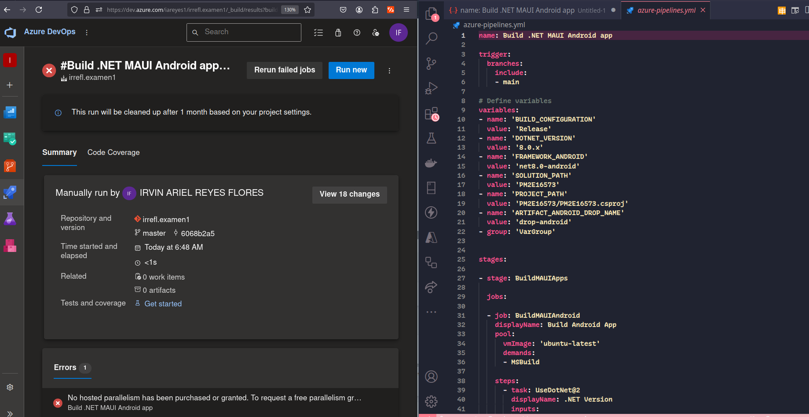

# PM2E16573
## Examen Programacion Movil 2 

### Integrantes
- Irvin Flores 201730020065

### Password del proyecto
Se ha provisto por Whatsapp al Maestro con todas las instrucciones.

# Rubrica

- Examen no subido a Github será tomado a cero (0 Puntos).
- Examen sin video de prueba es tomado a cero (0 Puntos).
- Examen con link roto (no accesible) será tomado a cero, favor validar que su link funcione.
- El examen tiene un solo intento.
- Se darán 2 puntos por subida a Microsoft DevOps.
- Colocar como respuesta a este apartado el link de GitHub.

---

# Entregables (Rubrica de evaluación)
- Video de Prueba Funcionalidad = https://www.youtube.com/watch?v=xn56ShKHXnY
- Azure = 

## Pantalla Inicial (1)
- [x] Salvar el sitio a una base de datos SQLite (2 Punto(s))
- [x] Clase sitios (Imagen, latitud, longitud, descripción) (1 Punto(s))
- [x] Si GPS inactivo mostrar alerta respectiva (1 Puntos)
- [x] Tomar imagen del sitio en donde se encuentre (0.5 Puntos)
- [x] Realizar las validaciones respectivas al INPUT de Usuario (0.5 Puntos)

## Pantalla de Lista (2)
- [x] Conectarse a SQLite para listar los sitios guardados (1 Punto(s))
- [x] Eliminar sitio seleccionado (1 Punto(s))
- [x] Actualizar sitio seleccionado (1 Punto(s))
- [x] Ir a la Ubicación en el Mapa (2 Punto(s))
- [x] Colocar la imagen en el la lista (2 Punto(s))

## Pantalla Mapa (3)
- [x] Mostrar el punto en el mapa utilizando un Pin con la descripción corta de la ubicación (0.5 Punto(s))
- [x] Utilizar IsShowingUser para colocar el punto en el mapa (0.5 Punto(s))
- [x] Detectar si el GPS está activo (0.5 Punto(s))
- [x] Compartir Imagen del Sitio seleccionado con otras Aplicaciones (1.5 Punto(s))

---

## Pantalla Inicial (Total: 6 Puntos)

### Salvar el sitio a una base de datos SQLite (2 Puntos)

**Criterios de Evaluación:**
- [x] Implementación correcta de la funcionalidad de guardado.
- [x] Verificación de que los datos se almacenan en la base de datos SQLite.

### Clase sitios (Imagen, latitud, longitud, descripción) (1 Punto)

**Criterios de Evaluación:**
- [x] Creación y utilización de una clase Sitio con los atributos: Imagen, latitud, longitud, descripción.
- [x] Uso adecuado de encapsulamiento y propiedades.

### Si GPS inactivo mostrar alerta respectiva (1 Punto)

**Criterios de Evaluación:**
- [x] Implementación de detección del estado del GPS.
- [x] Mostrar una alerta al usuario si el GPS está inactivo.

### Tomar imagen del sitio en donde se encuentre (0.5 Puntos)

**Criterios de Evaluación:**
- [x] Funcionalidad para capturar una imagen del sitio actual.
- [x] Correcta integración con la cámara del dispositivo.

### Realizar las validaciones respectivas al INPUT de Usuario (0.5 Puntos)

**Criterios de Evaluación:**
- [x] Validaciones adecuadas para los datos ingresados por el usuario (e.g., campos vacíos, formato de datos).
- [x] Retroalimentación adecuada al usuario en caso de errores.

---

## Pantalla de Lista (Total: 7 Puntos)

### Conectarse a SQLite para listar los sitios guardados (1 Punto)

**Criterios de Evaluación:**
- [x] Conexión correcta a la base de datos SQLite.
- [x] Mostrar una lista de sitios guardados.

### Eliminar sitio seleccionado (1 Punto)

**Criterios de Evaluación:**
- [x] Implementación de la funcionalidad de eliminación de sitios.
- [x] Actualización de la lista después de la eliminación.

### Actualizar sitio seleccionado (1 Punto)

**Criterios de Evaluación:**
- [x] Funcionalidad para actualizar la información de un sitio.
- [x] Verificación de que los cambios se reflejan en la base de datos y en la interfaz.

### Ir a la Ubicación en el Mapa (2 Puntos)

**Criterios de Evaluación:**
- [x] Navegación desde la lista al mapa mostrando la ubicación seleccionada.
- [x] Precisión en la ubicación mostrada.

### Colocar la imagen en la lista (2 Puntos)

**Criterios de Evaluación:**
- [x] Mostrar la imagen del sitio junto con la información en la lista.
- [x] Adecuada carga y visualización de imágenes.

---

## Pantalla Mapa (Total: 3 Puntos)

### Mostrar el punto en el mapa utilizando un Pin con la descripción corta de la ubicación (0.5 Puntos)

**Criterios de Evaluación:**
- [x] Pin correctamente colocado en el mapa.
- [x] Descripción corta visible al seleccionar el pin.

### Utilizar IsShowingUser para colocar el punto en el mapa (0.5 Puntos)

**Criterios de Evaluación:**
- [x] Uso correcto de la propiedad IsShowingUser para mostrar la ubicación del usuario.
- [x] Verificación de la ubicación actual del usuario en el mapa.

### Detectar si el GPS está activo (0.5 Puntos)

**Criterios de Evaluación:**
- [x] Implementación de detección del estado del GPS.
- [x] Mostrar información relevante al usuario sobre el estado del GPS.

### Compartir Imagen del Sitio seleccionado con otras Aplicaciones (1.5 Puntos)

**Criterios de Evaluación:**
- [x] Funcionalidad para compartir imágenes con otras aplicaciones.
- [x] Integración adecuada con las opciones de compartir del sistema operativo.
- [x] A la espera de Microsoft para incrementar el procesamiento debido al error = ##[error]No hosted parallelism has been purchased or granted. To request a free parallelism grant, please fill out the following form https://aka.ms/azpipelines-parallelism-request

---

## Despliegue en AzureDevOps (Total: 2 Puntos)

### Despliegue de la app en AzureDevOps Pinepinelines (2 Puntos)

**Criterios de Evaluación:**
- [x] Se creo la organizacion para AzureDevOps
- [x] Se creo el azure-pipeline.yml para deployar los binarios para .NET MAUI
